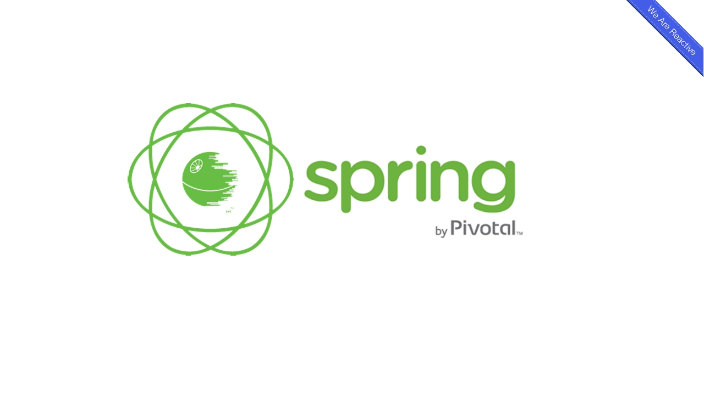
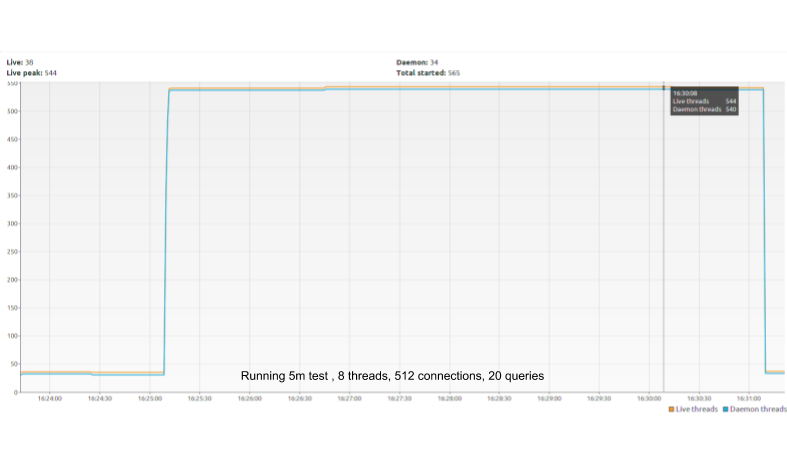
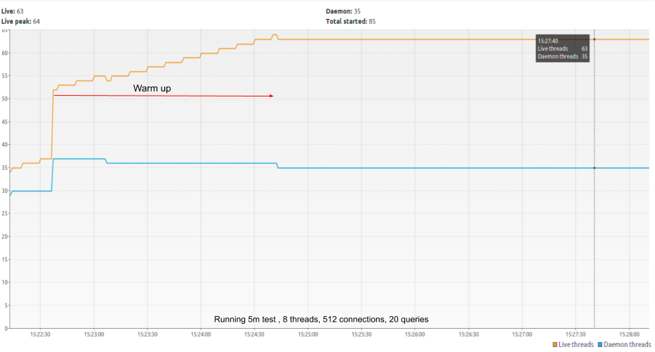

<h1 align="center">
    Gagner en performances Part.1:
     
    La Programmation réactive avec Spring
</h1>

    

Si ce genre de considération ne se posait peut-être pas il y a quelques dizaines d’années, nos applications web modernes doivent aujourd’hui, de par leur dynamisme et leur interactivité accru, gérer de très nombreux types d’évènements afin d’enrichir toujours plus l’expérience utilisateur.
Pour répondre au mieux à ces besoins, il nous faut déterminer quels outils seront les plus adaptés à cette tâche.
Chez CDiscount, une partie de notre environnement technologique étant constitué en Java, nous avons donc décidé d’évaluer plusieurs solutions liées à ce langage au travers d'un benchmark.

La première de ces solutions est une fonctionnalité majeure portée par Pivotal à leur framework Spring dans sa version 5 : [Spring-Webflux](https://docs.spring.io/spring/docs/current/spring-framework-reference/web-reactive.html).

Un des éléments cruciaux apporté par Webflux est l’important changement de paradigme vis-à-vis de Spring-MVC au travers des [Reactive Streams](https://www.reactive-streams.org/).
En effet, la [version initiale de Spring](https://docs.spring.io/spring/docs/current/spring-framework-reference/web.html#mvc) est traditionnellement construite sur l’API Servlet, utilisant une architecture I/O à blocage synchrone avec un modèle à 1 req/thread,

Webflux a opté, de son côté, pour une approche réactive, non bloquante, asynchrone, capable de gérer le phénomène de [back-pressure](https://blog.octo.com/les-strategies-de-gestion-de-pression-partie-i/) ainsi qu’un nombre important de connexions concurrentes.

### Qu'est ce que la programmation réactive ?

Les machines sont devenues, avec le temps, de plus en plus puissantes mais en parallèle les applications sont également devenues plus complexes et voraces en ressources, allant jusqu’à dépasser la courbe de croissance des améliorations matérielles, la programmation réactive part de ce simple constat.

L’idée est de proposer au développeur un modèle dans lequel il devient possible de créer des applications répondants aux 4 piliers du [manifeste réactif](https://www.reactivemanifesto.org/fr).

Selon ce dernier un système réactif est :

-   **Disponible**

    > _Il doit pouvoir répondre rapidement en toutes circonstances._

-   **Résilient**

    > _Il doit rester disponible en cas d’erreur. Ce comportement ne se limite pas aux systèmes critiques, du moment qu’un système n’est plus en mesure de répondre après une panne, il ne s’agit pas d’un système robuste._

-   **Élastique**

    > _Il doit rester disponible quelle que soit la charge de travail et doit pouvoir répondre au changement en terme de débit d’entrée en ajustant les ressources allouées à la réponse de ces entrées. Cela requiert une conception du système sans points de contention._

*   **Orienté Messages**

    > _Il doit utiliser le passage de messages asynchrones entre ses composants afin de garantir leur couplage faible, leur isolation, la transparence de localisation ainsi que la délégation d’erreurs à d’autres composants._

De façon pragmatique, disons qu’en programmation réactive, tout est flux de données asynchrones, ils sont partout !

    

Il devient en effet concevable de créer des flux à partir de tout et n’importe quoi, absolument toute source de données est par essence un flux : les variables, les entrées utilisateurs, les collections, les propriétés, les caches, les structures de données, etc.
En plus de ça il est également possible de combiner des flux, les transformer, les filtrer ou les agréger.

### D'accord, mais comment gérer le cas JDBC ?

L'accès aux données en Java, dans le cas d'une BDD relationnelle, se fait traditionnellement via JDBC _[(Java DataBase Connectivity)](https://fr.wikipedia.org/wiki/Java_Database_Connectivity)_. Le souci, dans le cadre du modèle réactif, est que JDBC est par nature bloquant. L'ensemble de notre démarche n'aurait donc plus beaucoup de sens si nous insérions ce genre de point de contention dans notre architecture.
C'est ici qu'intervient [PgClient](https://www.julienviet.com/reactive-pg-client/guide/java/),
comme son nom l'indique, il s'agit d'un client PostgreSQL.
Simple, légere, réactive, et surtout non bloquante, cette solution nous permet donc de gérer plusieurs connexions par thread vers notre base de données là ou JDBC vient ouvrir 1 thread par connexion.

> Parenthèse sur une autre technologie présente sur le marché, [R2DBC](https://r2dbc.io/) semble prometteur mais n'a pas été retenu pour notre benchmark car celui-ci en est encore au stade experimental.

## Benchmark

> **_A Savoir:_**
>
> -   Concernant la conception du bench à proprement parler nous nous sommes grandement inspirés des travaux de [Techempower](http://www.techempower.com/)
> -   **Infra** :
>     **x3 Machines** (Serveur, Client, BDD) ///
>     **OS**: Debian GNU/Linux 9.6 (stretch) ///
>     **RAM**: 3.8 Go ///
>     **CPU**: Intel(R) Xeon(R) CPU E5-2673 v4 @ 2.30GHz / 2 Cores

Ce benchmark se décompose en trois tests:

-   Un premier retournant simplement une string par requête HTTP
-   Un second effectuant une seule query sur la base donnée pour chaque requête HTTP
-   Un troisième effectuant vingt queries vers la base de donnée pour chaque requête HTTP

Chaque test est exécuté pendant 15 secondes avec un pool de 512 connexions.

  

      
  

> _(Résultats exprimés en Req/Secondes)_

Comme on peut le constater, l'approche réactive de Spring performe immédiatement sur toute la série de tests.

Seconde donnée intéressante, nous avons également consulté la consommation de threads par le logiciel :

-   Blocking Spring :

     

        
    

-   Reactive Spring:

     

        
    

La version bloquante du framework ouvre donc comme attendu un thread dédié par client. L'approche reactive utilise quand à elle un nombre fini de threads pour la même quantité de clients. Chaque thread nécessitant par défaut 1 Mo de RAM, le gain en matière de consommation de ressources n'est donc pas négligeable.

## Conclusion

> Pour les curieux et ceux qui voudraient faire leurs propres tests, le projet est dispo avec un quick-start sur [**Github**](https://github.com/SouenMazouin/framework-benchmarks).

« Le logiciel ralenti plus vite que le matériel n’accélère » disait Niklaus Wirth en 1995, le problème n'est pas nouveau, et les solutions existantes telles que le modèle réactif non plus, ce qui change, en revanche, c'est l'explosion du nombre d'applications candidates à ce type de modèle.
Néanmoins, si ces systèmes réactifs permettent effectivement une interaction accrue et donc une grande satisfaction de l'utilisateur, il convient de remarquer qu'il est tout de même nécessaire d'appréhender un nouveau paradigme ainsi qu'un nouveau niveau d'abstraction avant que cela ne devienne naturel. À noter également que le modèle réactif n'est pas une fin en soi et que d'autres pistes permettant de réduire l'impact des threads, telles que les [coroutines et les fibers](https://medium.com/software-development-2/coroutines-and-fibers-why-and-when-5798f08464fd), sont actuellement en cours d'élaboration pour Java.
